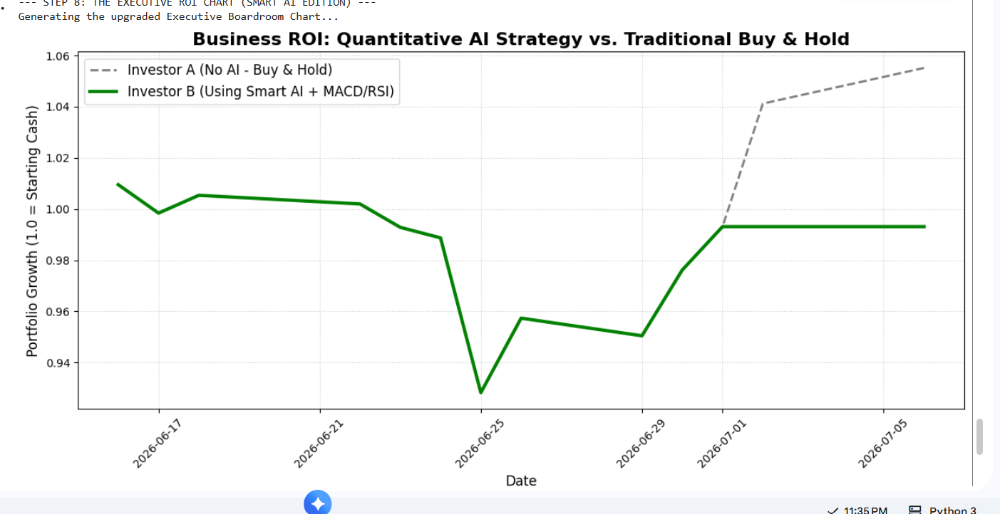
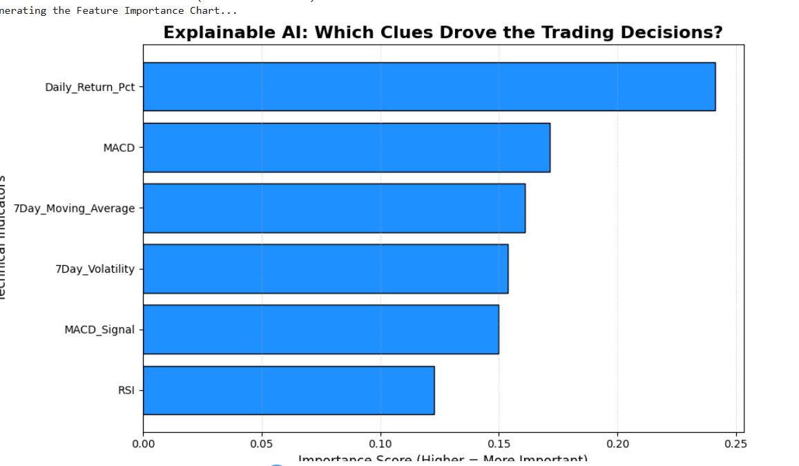

# 📈 Quantitative-Market-Model-with-ROI-Backtesting
(Quantitative Financial Analytics & Machine Learning Pipeline)

## 📌 Project Overview
This project is an automated, end-to-end data pipeline designed to extract real-world financial data, enforce strict data quality rules, and apply machine learning to forecast market trends. By combining quantitative finance indicators with Explainable AI (XAI), this system moves beyond basic data analysis to deliver actionable, risk-adjusted business intelligence.

## 🏗️ System Architecture 
The pipeline is built with senior-level engineering practices, processing data through 5 automated stages:
1. **API Ingestion:** Live extraction of market data via `yfinance`.
2. **Data Quality Framework:** Programmatic gatekeepers that validate boundary constraints and ensure zero null values before processing.
3. **Quantitative Feature Engineering:** Complex time-series calculations including MACD, Relative Strength Index (RSI), and rolling volatility metrics.
4. **Relational Database (`SQLite`):** A robust local data warehouse for storing cleaned and transformed records.
5. **Machine Learning & XAI:** A Random Forest classifier generating predictive signals, audited by Feature Importance metrics to ensure model transparency.

## 📊 Business Impact: AI vs. Buy & Hold
The ultimate goal of this pipeline is risk management. The model was backtested against a traditional Buy & Hold strategy. 

*Insight: While the AI missed a late-stage rally, it successfully identified market volatility and moved to cash, protecting the portfolio from drawdown risk.*

## 🧠 Explainable AI (Inside the Model)
To avoid "Black Box" decision-making, the model's brain was audited to determine which quantitative clues drove its trading behavior.

*Insight: The model heavily prioritized immediate price momentum (`Daily_Return_Pct`) and trend crossovers (`MACD`) over the RSI overheating indicator.*

## ⚙️ Core Technical Skills Demonstrated
* **Languages & Libraries:** Python, Pandas, NumPy, Scikit-Learn, Matplotlib
* **Data Engineering:** Automated ETL, API Integration, SQLite Database Management, Logging
* **Advanced Analytics:** Time-Series Forecasting, Quantitative Risk Math (Sharpe Ratio), Explainable AI (XAI)
